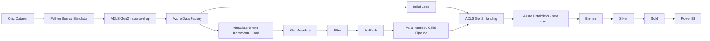

# Azure E-Commerce Lakehouse

End-to-end Data Engineering portfolio project built on Microsoft Azure.

## Objective

Build a cloud-based Lakehouse architecture for e-commerce data, covering source simulation, initial and incremental ingestion, orchestration, data quality, distributed transformations, dimensional modeling and analytical serving.

## Current architecture



## Technology stack

- Python
- Pandas
- Azure Data Lake Storage Gen2
- Azure Data Factory
- Microsoft Entra ID
- Managed Identity / Azure RBAC
- Git / GitHub
- Azure Databricks *(next phase)*
- PySpark *(next phase)*
- Delta Lake *(next phase)*
- Power BI *(next phase)*

## Implemented

### Source simulation

The original Olist dataset is kept immutable locally. Python scripts generate:

- an initial load for customers, products, sellers and category translation;
- monthly transactional batches for orders, order items and payments.

### Azure ingestion

Implemented:

- ADLS Gen2 with hierarchical namespace;
- private `lakehouse` container;
- `source-drop` and `landing` zones;
- Microsoft Entra ID / RBAC access;
- ADF linked service using Managed Identity;
- initial-load pipeline;
- parameterized monthly batch pipeline;
- metadata-driven master pipeline using Get Metadata, Filter, ForEach and Execute Pipeline;
- full historical ingestion into the Landing zone.

## Repository structure

```text
.
├── src/
│   └── source_simulator/
├── data/
│   ├── raw_original/
│   └── source_simulator/
├── adf/
├── docs/
├── requirements.txt
└── .gitignore
```

Raw datasets and generated batches are intentionally excluded from Git.

## Upcoming implementation

### Phase 2 — Lakehouse processing

- Create Azure Databricks workspace with cost-controlled compute.
- Connect Databricks securely to ADLS Gen2 using Managed Identity / Access Connector.
- Build the Bronze layer with PySpark.
- Store Bronze data as Delta Lake tables.
- Add ingestion metadata such as batch month, source file and ingestion timestamp.

### Phase 3 — Data quality and Silver layer

- Apply schema and data-type normalization.
- Deduplicate records.
- Validate nulls and business rules.
- Implement referential-integrity checks.
- Route invalid records to a quarantine area.
- Build curated Silver tables.
- Implement idempotent processing using Delta MERGE.

### Phase 4 — Gold analytical model

- Build dimensions for customers, products, sellers and dates.
- Build order and order-item fact tables.
- Create business aggregations such as daily sales, revenue and category performance.
- Prepare datasets for analytical consumption.

### Phase 5 — Incremental control and orchestration

- Add a watermark/control table.
- Track the last successfully processed batch.
- Prevent unnecessary historical reprocessing.
- Integrate ADF with Databricks.
- Orchestrate the full flow from ingestion to Gold.

### Phase 6 — Consumption, quality and delivery

- Connect Power BI to Gold.
- Create a compact business dashboard.
- Add automated data-quality tests.
- Add GitHub Actions CI.
- Export and version Azure artifacts.
- Complete final architecture documentation.
- Record an end-to-end demo video.

## Target final flow

```text
Olist / Source Simulator
        ↓
ADLS Gen2 - source-drop
        ↓
Azure Data Factory
        ↓
ADLS Gen2 - landing
        ↓
Azure Databricks + PySpark
        ↓
Bronze / Delta Lake
        ↓
Silver + Data Quality
        ↓
Gold
        ↓
Power BI
```
