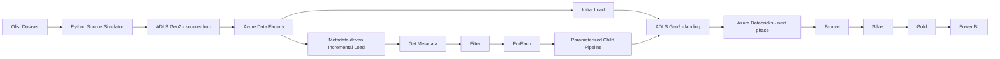

# Azure E-Commerce Lakehouse

End-to-end Data Engineering portfolio project built on Microsoft Azure.

## Objective

Build a cloud-based Lakehouse architecture for e-commerce data, covering source simulation, initial and incremental ingestion, orchestration, data quality, distributed transformations, dimensional modeling and analytical serving.

## Current architecture



## Technology stack

- Python
- Pandas
- Azure Data Lake Storage Gen2
- Azure Data Factory
- Microsoft Entra ID
- Managed Identity / Azure RBAC
- Git / GitHub
- Azure Databricks *(next phase)*
- PySpark *(next phase)*
- Delta Lake *(next phase)*
- Power BI *(next phase)*

## Implemented

### Source simulation

The original Olist dataset is kept immutable locally. Python scripts generate:

- an initial load for customers, products, sellers and category translation;
- monthly transactional batches for orders, order items and payments.

### Azure ingestion

Implemented:

- ADLS Gen2 with hierarchical namespace;
- private `lakehouse` container;
- `source-drop` and `landing` zones;
- Microsoft Entra ID / RBAC access;
- ADF linked service using Managed Identity;
- initial-load pipeline;
- parameterized monthly batch pipeline;
- metadata-driven master pipeline using Get Metadata, Filter, ForEach and Execute Pipeline;
- full historical ingestion into the Landing zone.

## Repository structure

```text
.
├── src/
│   └── source_simulator/
├── data/
│   ├── raw_original/
│   └── source_simulator/
├── adf/
├── docs/
├── requirements.txt
└── .gitignore
```

Raw datasets and generated batches are intentionally excluded from Git.

## Next phase

```text
Landing
  ↓
Azure Databricks + PySpark
  ↓
Bronze (Delta)
  ↓
Silver + Data Quality
  ↓
Gold
  ↓
Power BI
```

Planned work:

- Azure Databricks workspace and secure ADLS access
- Bronze ingestion with PySpark and Delta Lake
- Silver transformations and quarantine
- Idempotent MERGE processing
- Gold dimensional model
- Watermark/control layer
- ADF + Databricks orchestration
- Power BI
- Automated tests and CI/CD
- Final demo video
