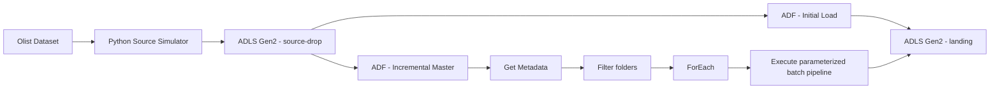

# Architecture

## Current implemented architecture



## ADLS logical structure

```text
lakehouse/
├── source-drop/
│   ├── initial/
│   └── incremental/
│       └── batch_month=YYYY-MM/
├── landing/
│   ├── initial/
│   └── incremental/
│       └── batch_month=YYYY-MM/
├── bronze/
├── silver/
├── gold/
├── quarantine/
├── control/
└── logs/
```

## Initial ingestion

```text
source-drop/initial/
  ↓
Azure Data Factory
  ↓
landing/initial/
```

Initial entities:

- customers
- products
- sellers
- product category translation

## Incremental ingestion

```text
source-drop/incremental/batch_month=YYYY-MM/
  ↓
Get Metadata
  ↓
Filter
  ↓
ForEach
  ↓
Parameterized child pipeline
  ↓
landing/incremental/batch_month=YYYY-MM/
```

Each monthly batch contains:

- `orders.csv`
- `order_items.csv`
- `order_payments.csv`

## Design decisions

- The original local Olist files remain immutable.
- Python simulates an upstream source system.
- `source-drop` represents files delivered by an external system.
- ADF is responsible for orchestration and movement, not heavy transformation.
- Landing preserves source files before transformation.
- Monthly partitioning provides a simple, explicit incremental-load strategy.
- Managed Identity and RBAC are used instead of storage account keys.
- Databricks will own distributed transformation and Medallion processing in the next phase.
